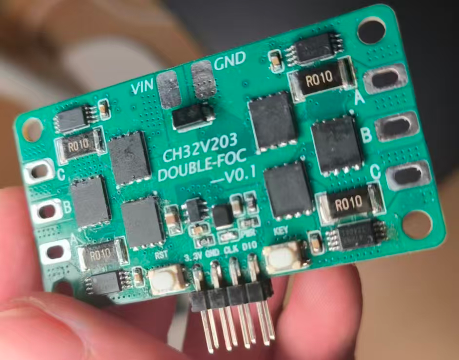
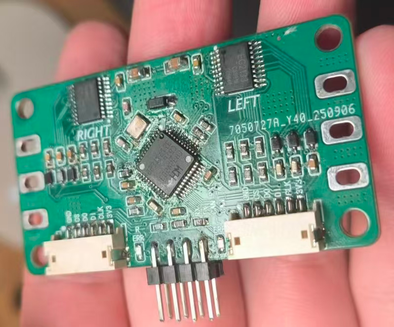

# CH32V203 DOUBLE-FOC



## 功能概览

- 左、右两路电机控制均在固件中启用，每路输出三相 PWM。
- 使用 MT6701 磁编码器读取电角度/机械角度；两路编码器共用 SPI2，通过独立片选读取。
- 固件包含开环、速度、角度及电流相关控制模式代码；实际可用模式受电机参数、传感器接线和 `driver_config.h` 配置影响。
- 支持 UART 双电机命令接收和状态数据回传。
- 固件包含电流采样、电池电压采样、按键零点校准和 LED 状态指示代码。

当前源码默认配置为速度闭环、SVPWM-7、20 kHz 开环控制参数、14 位编码器精度、460800 baud 串口。注意：源码里的频率常量和定时器实际输出频率应结合系统时钟与定时器配置核算，不能只凭宏名作为实测值。

## 硬件与接线

照片能确认板上有 `VIN`、`GND` 和两组标记为 A/B/C 的电机相线接口。`VIN` 的允许电压、极性保护能力、每路最大电流以及接口对应左/右电机，请以原理图和 PCB 网络标注为准。接线前断开电源；首次调试请使用限流电源，并确保电机及负载固定可靠。

### 固件当前引脚配置

下表是从源码读取的配置，不保证与 PCB 实际布线、旧版引脚说明或板上接口顺序一致。**在解决下一节列出的冲突前，不要据此直接接线或带电运行。**

| 功能 | 源码配置 | 来源 |
| --- | --- | --- |
| 左电机三相 PWM | PB8、PB7、PB6 | `Hardware/pwm_output.h` |
| 右电机三相 PWM | PA0、PA1、PA2 | `Hardware/pwm_output.h` |
| MT6701 SPI2 时钟/数据 | PB13 / PB14 | `Hardware/mt6701.h` |
| 左/右编码器片选 | PB12 / PB11 | `Hardware/mt6701.h` |
| UART 初始化 | USART1；GPIO 配置为 PA9 TX、PA10 RX | `Debug/debug.c` |
| ADC 扫描通道 | ADC1 通道 3 至 7，对应 PA3 至 PA7 | `Hardware/driver_adc.c` |
| 按键 | PA8，低电平有效 | `Hardware/driver_gpio.h`、`Hardware/driver_gpio.c` |
| LED | 左 PC13，右 PB0 | `Hardware/driver_gpio.h` |

### 已知资料冲突

工程内的 `引脚定义.txt` 与实际源码存在多处不一致，需结合硬件原理图/PCB确认并统一：

- 引脚文档把六路 PWM 写为 PA8/PA9/PA10 和 PB13/PB14/PB15；`pwm_output.h` 实际配置为左侧 PB8/PB7/PB6、右侧 PA0/PA1/PA2。
- 引脚文档写 UART TX/RX 为 PA2/PA3；`Debug/debug.c` 初始化 USART1，并将 GPIO 配为 PA9/PA10。
- 引脚文档写电流采样 IA/IB/IC 为 PA0/PA1/PA7，且 Vin 也写 PA7；`driver_adc.c` 实际扫描 PA3 至 PA7，其中固件将前四个采样值用于两路电机 A/C 相电流，将第五个值用于电池电压读取。
- 引脚文档把按键写为 PB12；GPIO 代码实际使用 PA8，而 PB12 在编码器配置中是左编码器片选。

以上差异可能来自旧版文档、源码配置或硬件版本变化。应以对应 PCB 版本的原理图和实际板卡测量为准，并在使用前更新固件和文档。硬件工程位于 [`硬件原理图和PCB`](硬件原理图和PCB/)。

## 串口协议

串口参数：460800 baud、8 数据位、无校验、1 停止位（8-N-1）。二进制控制帧固定为 6 字节：

| 字节 | 内容 |
| --- | --- |
| 0 | 帧头 `0xA5` |
| 1-2 | 左电机有符号 16 位目标值，高字节在前 |
| 3-4 | 右电机有符号 16 位目标值，高字节在前 |
| 5 | 校验和：前 5 字节相加后保留低 8 位 |

示例：默认速度闭环下，左电机目标 `+1000 RPM`、右电机目标 `-1000 RPM`：

```text
A5 03 E8 FC 18 A4
```

目标值含义取决于 `FOC_MODE`：开环模式是有符号占空比指令（文档约定 0-10000 对应 0-100%）；速度模式单位为 RPM；角度模式单位为编码器计数。源码默认 `FOC_MODE` 为速度环。

当前默认启用速度数据回传。回传字段由 `DATA_PRINTF`、`VECOCITY_PRINTF`、`ANGLE_PRINTF` 等宏控制；默认输出左右电机滤波速度以及结束字段 `0`，并以逗号分隔、CRLF 结尾。输出由 TIM3 中断调用，源码注释目标周期为 1 ms。切换回传字段后，上位机解析格式也要同步调整。

## 工程结构

```text
驱动代码/CH32V203C8T6 FOC双驱/
├── Core/                 RISC-V 核心支持
├── Debug/                WCH 调试/串口打印支持
├── Hardware/             ADC、GPIO、PWM、串口、MT6701、定时器等驱动
├── Ld/                   链接脚本
├── Peripheral/           CH32V20x 外设库
├── Software/             FOC、电机控制、PID、协议、电流与电池模块
├── Startup/              启动文件
├── User/                 main 与中断入口
├── Double_FOC.wvproj     MounRiver Studio 工程
├── Double_FOC.launch     OpenOCD 调试启动配置
├── 引脚定义.txt          引脚说明（使用前请核对已知冲突）
└── 通讯格式.txt          串口协议说明

硬件原理图和PCB/          PCB 工程文件
```

## 编译与下载

1. 安装与该工程兼容的 MounRiver Studio（工程生成文件标记 MRS 1.9.2）。
2. 在 MounRiver Studio 中导入 `驱动代码/CH32V203C8T6 FOC双驱/Double_FOC.wvproj`。
3. 检查 `Software/driver_config.h` 中的电机使能、控制模式、电流采样类型和保护选项；根据电机及板卡实测参数校准 PID、极对数、方向和零点。
4. 执行 Build。工程生成文件位于工程的 `obj/` 目录，包含 `Double_FOC.elf`、`Double_FOC.hex` 等构建产物。
5. 使用与 CH32V203 兼容的 WCH 调试/下载器连接板上调试接口，通过 MounRiver Studio 下载并调试。首次连接前核对调试器型号、接口针脚定义和电平。

工程配置默认开启左右电机，但电池欠压保护、堵转保护和看门狗均在 `driver_config.h` 中关闭。首次上电前请检查这些保护是否满足你的实际应用要求。

## 校准与调试建议

- 首次转动前，确认相线顺序、编码器安装方向、极对数和电流采样极性；错误配置可能导致电机抖动、过流或失控。
- 按键扫描代码在检测到按键低电平并计数达到阈值时，会对启用的电机执行零点校准并写入 Flash。按键 GPIO 的文档与源码存在冲突，先确认板上实际接线。
- 先不连接机械负载，以限流电源和低目标值验证单路电机，再逐步验证双路。不要在通电时插拔电机相线或调试线。
- 若串口无响应，先核对板卡 UART 实际引脚、共地、波特率和 6 字节校验和；UART 引脚当前存在上述源码/文档冲突。

## 当前待完善项

- 统一原理图、PCB、固件和 `引脚定义.txt` 中的引脚定义。
- 核实 PA3 至 PA7 ADC 采样映射、Vin 分压网络与电流采样输入的实际对应关系。
- 补充经硬件验证的输入电压、电流限制、功率器件型号、散热要求和接线图。
- 继续优化编码器读取速度与 FOC 计算效率（工程原引脚说明中的待优化项）。